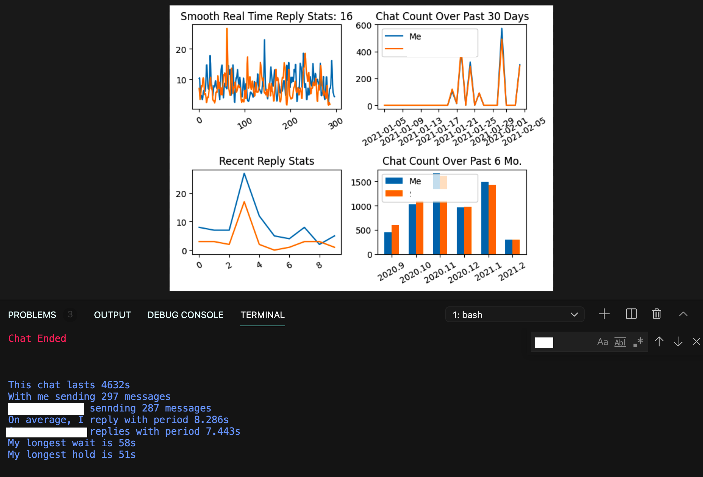

# Wechat_Analysis

## Obtaining the Key to *.db
First disable LLDB by entering the OS recovery mode and issuing the following command
```
csrutil disable 
```
to disable System Integrity Protection (SIP). Remember to enable it after obtaining the key by entering the recovery OS and issuing 
`csrutil enable` in the terminal

Open WeChat, without logging in. Type `lldb -p $(pgrep WeChat)` in terminal. You should see some output, with the last two lines similar to
```
Executable module set to "/Applications/WeChat.app/Contents/MacOS/WeChat".
Architecture set to: x86_64h-apple-macosx-.
```
You should also be prompted to the `lldb` interface. Issue the command `br set -n sqlite3_key`. You should see something like `Breakpoint 1: 2 locations.`, ignore any errors. Type c in the terminal for continue. Log in WeChat and then type `memory read --size 1 --format x --count 32 $rsi`. You should see output of the form 
```
0x000000000000: 0x00 0x00 0x00 0x00 0x00 0x00 0x00 0x00
0x000000000000: 0x00 0x00 0x00 0x00 0x00 0x00 0x00 0x00
0x000000000000: 0x00 0x00 0x00 0x00 0x00 0x00 0x00 0x00
0x000000000000: 0x00 0x00 0x00 0x00 0x00 0x00 0x00 0x00
```
Save it to the a txt file and run `utils/KeyParser.py` to obtain a key. That key will allow you to open db files stored in WeChat.

## Backup Iphone Chat History
使用 [iphone Backup Extractor](https://www.iphonebackupextractor.com/free-download/) 可以方便的解码ios版微信的数据库。备份后可以在 `Application/com.tencent.xin/Documents/{你的微信号md5加密}/DB` 找到。聊天记录存储在`message_*.sqlite`中，没有密码。

## 效果(实时)




## TODO:
整合iPhone和Mac聊天记录；更换GUI，使用plotly；增加sentimental analysis等。

## References
```
https://www.macworld.co.uk/how-to/how-turn-off-mac-os-x-system-integrity-protection-rootless-3638975/
https://blog.csdn.net/u013051748/article/details/108394306
https://blog.csdn.net/swinfans/article/details/88712593
https://www.jianshu.com/p/90224ab9cdf2
https://www.lianxh.cn/news/d34f09cb214e0.html
https://www.jianshu.com/p/0f41c120160d
```